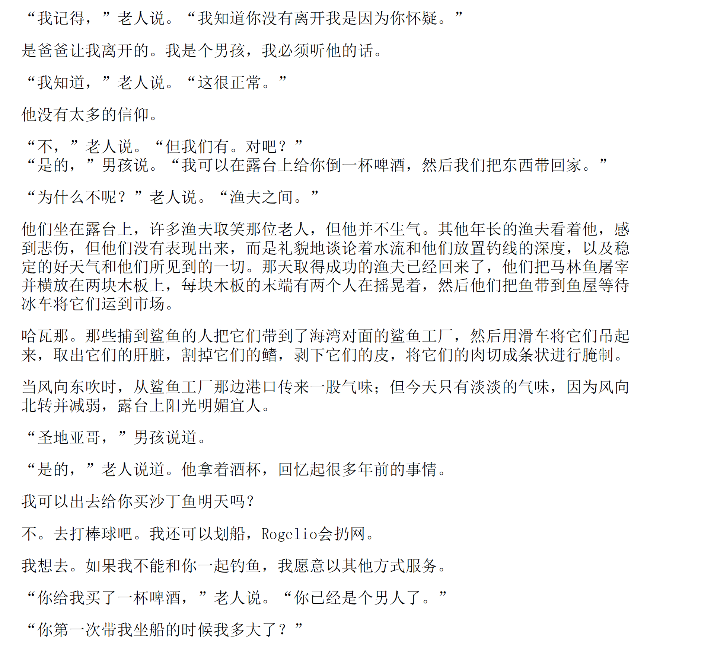
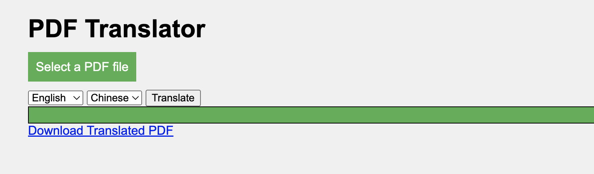

# OpenAI-Translator 实战总结

最近在极客时间学习《AI 大模型应用开发实战营》，自己一边跟着学一边开发了一个进阶版本的 OpenAI-Translator，在这里简单记录下开发过程和心得体会，供有兴趣的同学参考

- 功能概览
  - 通过openai的chat API，实现一个pdf翻译器
  - 实现一个web GUI，可以上传pdf文件，然后翻译成目标语言的pdf文件
  - 实现了一个openai的plugin，pdf翻译器

- 系统概述
  ```mermaid
    graph LR
    0[PDF File] -- Load --> A1[PDF Parser] 
    A2[Model] -- Prompt --> B[ChatGPT]
    B[ChatGPT] -- Response --> A3[Writer] -- Save --> D[Translated PDF File]
    subgraph A[PDF Translator]
     A1[PDF Parser] -- Parsed Content --> A2[Model] 
     A3[Writer]
    end
  ```
  - PDF Parser
    - 通过pdfminer.six库，解析pdf文件，得到pdf的内容
    - 通过解析pdf的内容，得到pdf的图片，表格，文本等内容
  - Model
    - 通过prompt的方式，把pdf的内容转化为目标语言
  - Writer
    - 把翻译后的内容，写入到pdf 或者markdown文件中

- Prompt 优化过程
  - 第一次尝试
    - 为了支持其他语言的翻译，在prompt里把目标语言设置为变量 `{target_language}`
    ```
    [{
        "role": "system",
        "content": "For the input text, translate it into {target_language} as native speaker"
    },
    {
        "role": "user",
        "content": "“Santiago,” the boy said.\n"
    }]
    ```
  
     - 问题
       - 表格格式没有保留
       - 翻译不准确，表现是没有把user 的content内容翻译成目标语言

  - 优化Prompt里system的描述
    - 增加格式化输出的描述 `output each of these data in json format`，方便代码后续解析
    - 增加prompt，让模型知道需要翻译的内容所属语言是什么 `Identify the language of input text`
    ```shell
    [{
        "role": "system",
        "content": "From the input text, output each of these data in json format:\n\n
                    1. (language) Identify the language of input text \n
                    2. (translation) Translate to Chinese as a native speaker and keep the original character format of the text unchanged\n
                    3. (translation_language) The language translated from the input text"
    },
    {
        "role": "user",
        "content": "“Santiago,” the boy said.\n"
    } ]
    ```
  
     - 问题
       - 偶尔翻译不准确，表现是没有把user 的content内容翻译成目标语言

  - 再次优化Prompt，增加**黑魔法，think step by step**
    - 翻译text的prompt
    ```
       [{
            "role": "system",
            "content": f"You act as a language expert, do a language translation job, here are the steps:\n\n"
                       f"1. (language) Identify the language of input text \n"
                       f"2. (translation) Translate the input text to {target_language} as a native speaker \n"
                       f"3. (output) output the language and translation in json format\n"
        },
            {
                "role": "user",
                "content": f"“Santiago,” the boy said.\n"
            }
        ]
    ```
    - 翻译table的prompt
      - 加注：保持表格的原有格式与标点符号 `format and maintain spacing (spaces, separators), and return in tabular form`
    ```
         [{
            "role": "system",
            "content": f"From the input text, do a language translation job, here are the steps:\n\n"
                       f"1. (language) Identify the language of input text \n"
                       f"2. (translation) Translate the input text to {target_language} as a native speaker, format and maintain spacing (spaces, separators), and return in tabular form\n"
                       f"3. (output) output the language and translation in json format"
        },
            {
                "role": "user",
                "content": f"{table content}"
            }
        ]
    ```

- 代码结构
  - 重构content
    ```mermaid
     classDiagram
     class Content
     Content : set_translation
     class ImageContent
     ImageContent : set_translation
     class TextContent
     TextContent : set_translation     
     Content <|-- ImageContent
     Content <|-- TextContent
    ```
  - 重构parser
    ```mermaid
     classDiagram
     class PageParser
     PageParser : parse
     class PageImageParser
     PageImageParser : parse
     class PageTableParser
     PageTableParser : parse
     class PageTextParser
     PageTextParser : parse     
     PageParser <|-- PageImageParser
     PageParser <|-- PageTableParser
     PageParser <|-- PageTextParser
    ```    
  - 重构writer
    ```mermaid
     classDiagram
     class Writer
     Writer : save
     class PDFWriter
     PDFWriter : save
     class MarkdownWriter
     MarkdownWriter : save     
     Writer <|-- PDFWriter
     Writer <|-- MarkdownWriter
    ```
    
- PDF格式
  - 为了保持PDF文档内容结构，需要保留原文档的空格，换行，分隔符等
  - 分段策略
    - 以空行为分段标志
  - 翻译后的文档，保持原文档的空格，换行，分隔符等
  - 翻译后老人与海的pdf文档
    

- 图形用户界面GUI 设计
  - 设计以及代码由 gpt4 生成
  - 如下是使用的prompt
    - 对一个翻译pdf功能的服务器设计一个GUI
    - 请用python实现一下
    - 请用 HTML、CSS 和 JavaScript 实现一个你上文提到的UI
    - 请增加这些功能显示文件上传和翻译进度、选择源语言和目标语言、处理文件上传大小的限制
    - 对于代码的错误，交给gpt4，让它来修复代码中的问题
  - 详见 https://chat.openai.com/share/0385f4c2-9585-4c90-bcf6-6bdadce1019c
  - Web GUI效果图
    
  
- plugin开发
  - openapi文档的生成，通过gpt4生成
    - 通过把路由代码，交给gpt，然后让它生成对应的openapi文档，然后对应着plugin 官方文档修正下，就可以了

- 收获和总结
  - openai API的使用 chat API调用，以及各个参数的含义
  - openai playground的使用，调试prompt很好用的工具
  - prompt的使用以及优化，这一点需要在实际的案例中加强训练
  - 熟悉了openai plugin开发步骤以及流程

